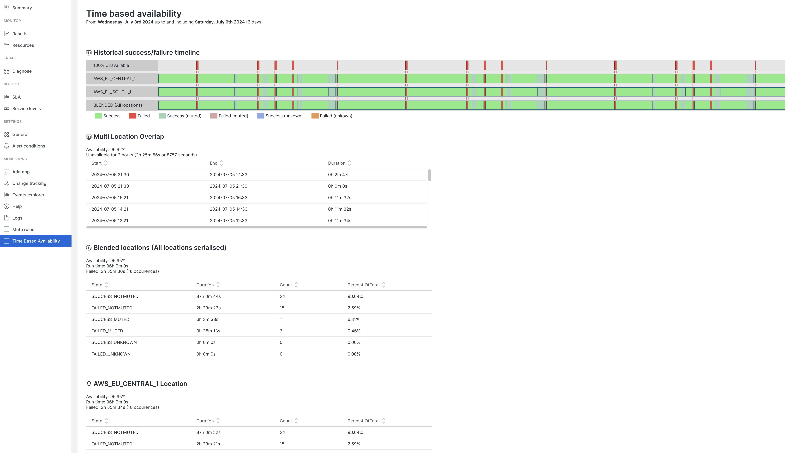

<a href="https://opensource.newrelic.com/oss-category/#new-relic-experimental"><picture><source media="(prefers-color-scheme: dark)" srcset="https://github.com/newrelic/opensource-website/raw/main/src/images/categories/dark/Experimental.png"><source media="(prefers-color-scheme: light)" srcset="https://github.com/newrelic/opensource-website/raw/main/src/images/categories/Experimental.png"></picture></a>

# Synthetic Time Based Availability

This project contains resources for visualising and processing time based availavility of New Relic synthetic monitors. Time based availability is calculated by measuring the duration between successfull and failing synhtetic checks providing as an output the duration of outages. This project includes a visualisation that can appear on the Synhtetic Monitor page and also an async data processor that calculates the availability data and records as a metric in NRDB:

- [tba-nerdlet](./tba-nerdlet): The nerdlet that runs in NR1
- [tba-summary-processor](./tba-summary-processor): An (optional) offline processor that generates summary data daily and posts back as a metric

## Support

Please use the Github issues facility.

## Contributing
We encourage your contributions to improve this project. Keep in mind when you submit your pull request, you'll need to sign the CLA via the click-through using CLA-Assistant. You only have to sign the CLA one time per project.
If you have any questions, or to execute our corporate CLA, required if your contribution is on behalf of a company,  please drop us an email at opensource@newrelic.com.

**A note about vulnerabilities**

As noted in our [security policy](../../security/policy), New Relic is committed to the privacy and security of our customers and their data. We believe that providing coordinated disclosure by security researchers and engaging with the security community are important means to achieve our security goals.

If you believe you have found a security vulnerability in this project or any of New Relic's products or websites, we welcome and greatly appreciate you reporting it to New Relic through [HackerOne](https://hackerone.com/newrelic).

## License
This project is licensed under the [Apache 2.0](http://apache.org/licenses/LICENSE-2.0.txt) License.

